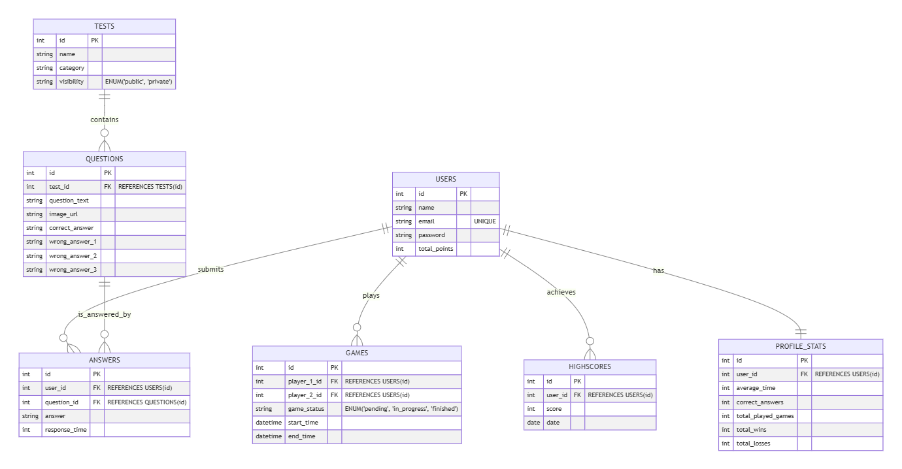

# **Tablas y Tipos de Datos 📊**

A continuación, se detallan las tablas de la base de datos para la aplicación **CodeRush** y los tipos de datos que se utilizan en cada una de ellas. Estas tablas son fundamentales para gestionar los usuarios, los tests, las preguntas, las respuestas, los puntajes y las estadísticas de los jugadores.

# 
---

## **1. Users 👤**

| **Campo**          | **Tipo de Dato**         | **Descripción**                                                      |
|--------------------|--------------------------|----------------------------------------------------------------------|
| `id`               | `SERIAL PRIMARY KEY`     | Identificador único para el usuario.                                 |
| `name`             | `VARCHAR(255)`            | Nombre del usuario.                                                  |
| `email`            | `VARCHAR(255) UNIQUE`     | Correo electrónico del usuario (único).                              |
| `password`         | `VARCHAR(255)`            | Contraseña encriptada del usuario.                                   |
| `total_points`     | `INTEGER DEFAULT 0`      | Puntaje total acumulado del usuario.                                 |

---

## **2. Tests 📝**

| **Campo**          | **Tipo de Dato**         | **Descripción**                                                      |
|--------------------|--------------------------|----------------------------------------------------------------------|
| `id`               | `SERIAL PRIMARY KEY`     | Identificador único para el test.                                    |
| `name`             | `VARCHAR(255)`            | Nombre del test.                                                     |
| `category`         | `VARCHAR(255)`            | Categoría del test (ej. JavaScript, CSS, etc.).                      |
| `visibility`       | `ENUM('public', 'private')` | Visibilidad del test: `public` (público) o `private` (privado).    |

---

## **3. Questions ❓**

| **Campo**          | **Tipo de Dato**         | **Descripción**                                                      |
|--------------------|--------------------------|----------------------------------------------------------------------|
| `id`               | `SERIAL PRIMARY KEY`     | Identificador único para la pregunta.                                |
| `test_id`          | `INTEGER REFERENCES Tests(id)` | Clave foránea que apunta a la tabla de Tests.                      |
| `question_text`    | `TEXT`                   | Texto de la pregunta.                                                |
| `image_url`        | `TEXT (opcional)`        | URL de la imagen de código (si la pregunta es visual).               |
| `correct_answer`   | `TEXT`                   | Respuesta correcta.                                                  |
| `wrong_answer_1`   | `TEXT`                   | Respuesta incorrecta 1.                                              |
| `wrong_answer_2`   | `TEXT`                   | Respuesta incorrecta 2.                                              |
| `wrong_answer_3`   | `TEXT`                   | Respuesta incorrecta 3.                                              |

---

## **4. Answers ✅**

| **Campo**          | **Tipo de Dato**         | **Descripción**                                                      |
|--------------------|--------------------------|----------------------------------------------------------------------|
| `id`               | `SERIAL PRIMARY KEY`     | Identificador único para la respuesta.                               |
| `user_id`          | `INTEGER REFERENCES Users(id)` | Clave foránea que apunta al usuario.                              |
| `question_id`      | `INTEGER REFERENCES Questions(id)` | Clave foránea que apunta a la pregunta.                          |
| `answer`           | `TEXT`                   | Respuesta dada por el usuario.                                       |
| `response_time`    | `INTEGER`                | Tiempo de respuesta en milisegundos del usuario.                     |

---

## **5. Highscores 🏆**

| **Campo**          | **Tipo de Dato**         | **Descripción**                                                      |
|--------------------|--------------------------|----------------------------------------------------------------------|
| `id`               | `SERIAL PRIMARY KEY`     | Identificador único para el puntaje.                                 |
| `user_id`          | `INTEGER REFERENCES Users(id)` | Clave foránea que apunta al usuario.                              |
| `score`            | `INTEGER`                | Puntaje obtenido.                                                   |
| `date`             | `TIMESTAMP DEFAULT CURRENT_TIMESTAMP` | Fecha en la que se logró el puntaje.                          |

---

## **6. Games 🎮**

| **Campo**          | **Tipo de Dato**         | **Descripción**                                                      |
|--------------------|--------------------------|----------------------------------------------------------------------|
| `id`               | `SERIAL PRIMARY KEY`     | Identificador único para la partida.                                 |
| `player_1_id`      | `INTEGER REFERENCES Users(id)` | Clave foránea que apunta al primer jugador.                        |
| `player_2_id`      | `INTEGER REFERENCES Users(id)` | Clave foránea que apunta al segundo jugador.                       |
| `game_status`      | `ENUM('pending', 'in_progress', 'finished')` | Estado de la partida: `pending` (pendiente), `in_progress` (en progreso), `finished` (finalizada). |
| `start_time`       | `TIMESTAMP DEFAULT CURRENT_TIMESTAMP` | Hora de inicio de la partida.                                      |
| `end_time`         | `TIMESTAMP (opcional)`   | Hora de finalización de la partida.                                 |

---

## **7. Profile_Stats 📊**

| **Campo**          | **Tipo de Dato**         | **Descripción**                                                      |
|--------------------|--------------------------|----------------------------------------------------------------------|
| `id`               | `SERIAL PRIMARY KEY`     | Identificador único para las estadísticas del perfil.                |
| `user_id`          | `INTEGER REFERENCES Users(id)` | Clave foránea que apunta al usuario.                              |
| `average_time`     | `INTEGER`                | Promedio de tiempo de respuesta en segundos.                         |
| `correct_answers`  | `INTEGER`                | Número de respuestas correctas del usuario.                          |
| `total_played_games` | `INTEGER`              | Número total de juegos jugados por el usuario.                       |
| `total_wins`       | `INTEGER`                | Número total de partidas ganadas.                                   |
| `total_losses`     | `INTEGER`                | Número total de partidas perdidas.                                   |

---

## **Relaciones entre las Tablas 🔗**

### **1. Users - Games**
- Relación **uno a muchos** (Un jugador puede tener muchas partidas).

### **2. Tests - Questions**
- Relación **uno a muchos** (Un test puede tener muchas preguntas).

### **3. Users - Answers**
- Relación **uno a muchos** (Un usuario puede dar muchas respuestas).

### **4. Questions - Answers**
- Relación **uno a muchos** (Una pregunta puede tener muchas respuestas).

### **5. Users - Highscores**
- Relación **uno a muchos** (Un jugador puede tener múltiples puntajes, aunque en la práctica generalmente habrá solo uno por jugador).

### **6. Users - Profile_Stats**
- Relación **uno a uno** (Cada usuario tendrá un único conjunto de estadísticas).

---

**Resumen 📋**

Las tablas definidas cubren todos los aspectos necesarios para gestionar la interacción entre jugadores, tests, preguntas, respuestas y puntajes en "CodeRush". Las relaciones entre las tablas aseguran la integridad de los datos y permiten generar estadísticas detalladas de cada usuario. 

Esto forma la base estructural que alimenta la lógica del juego y el seguimiento de la competencia en tiempo real. 🚀
